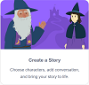

[back to main menu](https://lindsaycullum.github.io/cs-resource-instructions)

## Getting Started with Scratch

<ol>
  <li> Click <a href="https://scratch.mit.edu/ideas" target="_blank">here</a> to explore tutorials.</li>

  <li>Select "Create a story." 
    

    
Try out the <a href="https://scratch.mit.edu/projects/editor/?tutorial=tell-a-story" target="_blank">tutorial</a> to get a feel for the student experience. The <a href="https://resources.scratch.mit.edu/www/guides/en/StoryGuide.pdf" target="_blank">educator guide</a> will give you ideas on how to run a 1 hour tutorial using this resource. The <a href="https://resources.scratch.mit.edu/www/cards/en/story-cards.pdf">Coding cards</a> are useful if you want to print (and maybe laminate) instructions for students.

  </li>
  <li>Once your students have completed this tutorial and dabbled with the program, they will be prepared for animating their own story. This is a great way to make cross curricular connections. They will need to prepare by planning their story, and gathering their assets. They could take a photo to use as the backdrop of their story, use an image found online, or use something within the Scratch environment. They may draw their characters using the Scratch online tools, or use a pre-existing character. 
    
If students want to take photos of their artwork and drawings to use as their characters, they should change them into transparent PNGs, or the resulting animations will look clunky. One way to do it is to use an online tool to convert a white background into a transparent background: <a href="https://onlinepngtools.com/create-transparent-png" target="_blank">https://onlinepngtools.com/create-transparent-png

  </li>
</ol>
